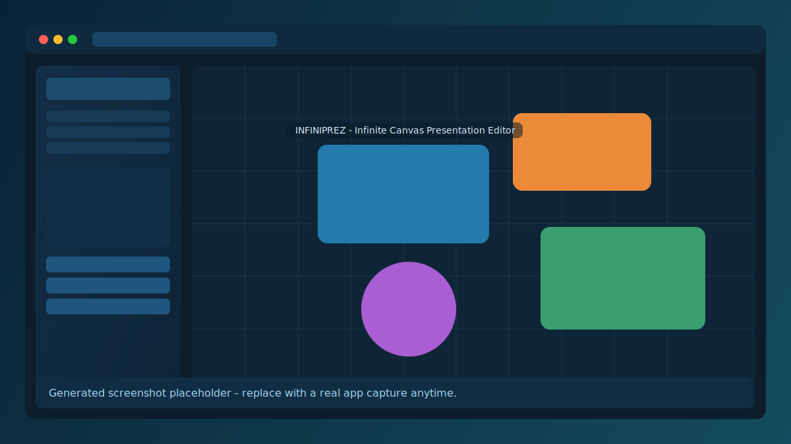

# Infiniprez

Infiniprez is a web presentation editor where your whole deck lives on one infinite, zoomable canvas. Instead of classic fixed slides, you create camera bookmarks and play them as smooth transitions.

## Live Demo (GitHub Pages)

https://fhorinek.github.io/Infiniprez/

## Screenshot

## Main Features

- Infinite canvas with pan, zoom, and rotation controls
- Slide bookmarks as camera states (position, zoom, rotation)
- Presentation playback with animated transitions and timed/manual triggers
- Drag-and-drop slide ordering and rich object editing
- Shapes, text, images, media, grouping, layering, and snapping tools
- Export presentation to standalone HTML

## Tech Stack

- React
- TypeScript
- Vite
- Zustand + Immer
- TipTap editor

## Disclaimer

This whole thing was vibe coded using mostly GPT Codex.
