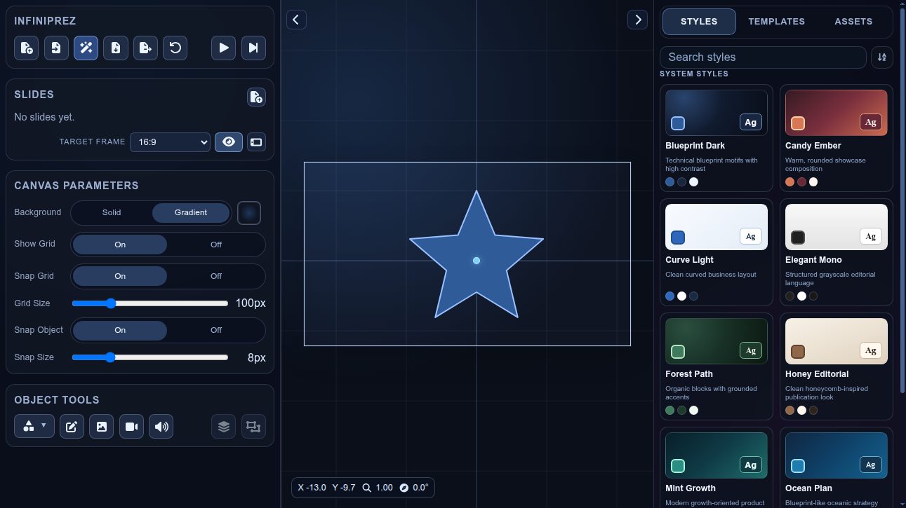

# Infiniprez

Infiniprez is a web presentation editor where your whole deck lives on one infinite, zoomable canvas. Instead of classic fixed slides, you create camera bookmarks and play them as smooth transitions.

## Live Demo (GitHub Pages)

https://fhorinek.github.io/Infiniprez/

## Screenshot

## Main Features

- Infinite canvas with pan, zoom, and rotation controls
- Slide bookmarks as camera states (position, zoom, rotation)
- Presentation playback with animated transitions and timed/manual triggers
- Drag-and-drop slide ordering and rich object editing
- Shapes, text, images, media, grouping, layering, and snapping tools
- Export presentation to standalone HTML

## Shortcuts

- `Middle mouse drag` -> Pan canvas
- `Left mouse drag on empty canvas` -> Pan canvas (in edit mode)
- `Shift + Left mouse drag on empty canvas` -> Marquee select (in edit mode)
- `Left click on object` -> Select object (on pointer up, if no drag occurred)
- `Wheel` -> Zoom canvas
- `Alt + Wheel` -> Rotate camera (10deg steps)
- `Ctrl/Cmd + Wheel` -> Scale selected object(s)
- `Ctrl/Cmd + Alt + Wheel` -> Fine scale selected object(s) (1/10 speed)
- `Shift + Wheel` -> Rotate selected object(s) (10deg steps)
- `Shift + Alt + Wheel` -> Fine rotate selected object(s) (1deg steps)
- `Shift + Middle click` -> Align selected object(s) with camera angle
- `Ctrl/Cmd + Z` -> Undo
- `Backspace` -> Delete selected object(s)

## Tech Stack

- React
- TypeScript
- Vite
- Zustand + Immer
- TipTap editor

## Disclaimer

This whole thing was vibe coded using mostly GPT Codex.
